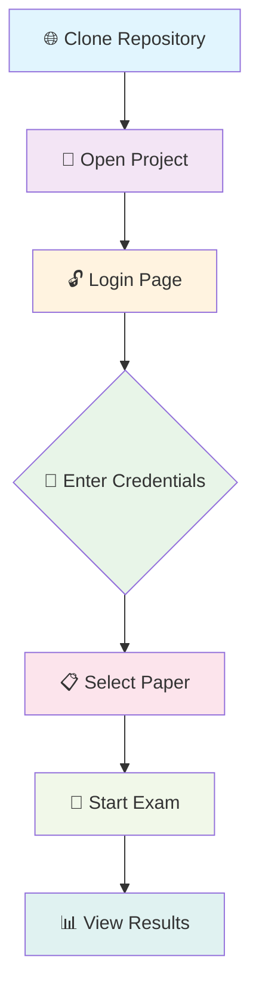

<div align="center">


# 🚀 **CREATED BY AKASH** 🚀


# 🏛️ BIHAR STET 2025 - CBT EXAM SYSTEM 🎓


<p align="center">
  
  
  
  
</p>


<p align="center">
  
  
  
  
</p>

---

## 🌟 **CREATED BY AKASH** 🌟


<div align="center">
  
  
</div>

<div align="center">
  
</div>

<p align="center">
  
</p>

<div align="center">
  
  
  
</div>

---

</div>

## 🚀 **FEATURES SHOWCASE**

<table>
<tr>
<td width="33%">

<td width="50%">
gual Excellence**
- 🇮🇳 **Hindi + English** Support
- 🔄 **Real-time Language Toggle**
- 📱 **Mobile Responsive Design**
- ⚡ **Lightning Fast Performance**

</td>
<td width="33%">

<td width="50%">
ced Analytics**
- 📈 **Real-time Progress Tracking**
- 🎯 **Question Palette Navigation**
- ⏱️ **Smart Timer Management**
- 🔒 **Secure Session Handling**

</td>
<td width="33%">

### 🎯 **Enhanced Features**
- 📚 **7 Complete Question Sets**
- 💾 **Auto-save & Backup**
- 🔍 **Advanced Search & Filter**
- 📊 **Detailed Test History**

</td>
</tr>
</table>

<div align="center">

## 🎯 **EXAM PAPERS OVERVIEW**

<table>
<tr>
<th>📚 Paper-I: Social Science</th>
<th>🏛️ Paper-II: Political Science</th>
</tr>
<tr>
<td>

**🎓 Class 9-10 Level**
- 📜 History & Culture
- 🌍 Geography & Environment  
- ⚖️ Civics & Constitution
- 💰 Economics & Development
- 🧠 Teaching Pedagogy
- 🌟 General Knowledge

**⏰ Duration:** 2:30 Hours  
**❓ Questions:** 150

</td>
<td>

**🎓 Class 11-12 Level**
- 📖 Indian Constitution
- 🤔 Political Theory
- 🌏 International Relations
- 👥 Political Thinkers
- 🏢 Public Administration
- 🔍 Comparative Politics

**⏰ Duration:** 2:30 Hours  
**❓ Questions:** 150

</td>
</tr>
</table>

</div>

## 🛠️ **QUICK START GUIDE**

<div align="center">



</div>


## 📁 **PROJECT ARCHITECTURE**

```
🏛️ BIHAR-STET-2025/
├── 🔐 stet_login.html          # Secure Login Gateway
├── 📋 paper_selection.html     # Interactive Paper Selection
├── 📊 test_history.html        # Enhanced Test History
├── 📝 stet_paper2_exam.html    # Paper-II Exam Interface
├── 📊 paper2_result.html       # Paper-II Results Dashboard
├── 🏛️ paper2_questions.js      # Set 1 - Political Science Q&A
├── 🏛️ paper2_new_set_questions.js # Set 2 - Fresh Questions
├── 🏛️ paper2_set3_NEW_FRESH.js # Set 3 - Enhanced Questions
├── 🏛️ paper2set4.js           # Set 4 - Latest Questions
├── 🏛️ paper2set5.js           # Set 5 - Premium Questions
├── 🏛️ paper2set6.js           # Set 6 - Advanced Questions
├── 🏛️ paper2set7.js           # Set 7 - Expert Questions
├── 🔧 shuffle_utility.js       # Question Shuffling Utility

├── 📚 paper1_questions.js      # 150 Social Science Q&A
├── 📝 stet_paper1_exam.html    # Paper-I Exam Interface
├── 📊 paper1_result.html       # Paper-I Results Dashboard
├── 🏛️ paper2_questions.js      # 150 Political Science Q&A
├── 📝 stet_paper2_exam.html    # Paper-II Exam Interface
├── 📊 paper2_result.html       # Paper-II Results Dashboard
EADME.md               # This Amazing Documentation
├── ⚖️ LICENSE                 # MIT License
└── 🚫 .gitignore              # Git Ignore Rules
```

## 🌐 **BROWSER COMPATIBILITY**

<div align="center">

| Browser | Support | Performance |
|---------|---------|-------------|
| 🟢 **Chrome** | ✅ Excellent | ⚡ 100% |
| 🟠 **Firefox** | ✅ Great | ⚡ 95% |
| 🔵 **Safari** | ✅ Good | ⚡ 90% |
| 🟣 **Edge** | ✅ Good | ⚡ 90% |

</div>

## 🎨 **TECHNOLOGY STACK**

<div align="center">

<table>
<tr>
<td align="center" width="25%">

<br><strong>HTML5</strong>
<br><em>Structure</em>
</td>
<td align="center" width="25%">

<br><strong>CSS3</strong>
<br><em>Styling</em>
</td>
<td align="center" width="25%">

<br><strong>JavaScript</strong>
<br><em>Functionality</em>
</td>
<td align="center" width="25%">

<br><strong>Git</strong>
<br><em>Version Control</em>
</td>
</tr>
</table>

</div>

## 📈 **PROJECT STATISTICS**

<div align="center">


guages](https://img.shields.io/badge/Languages-2-red?style=for-the-badge&logo=language&logoColor=white)

</div>

## 🤝 **CONTRIBUTING**

<div align="center">

**We welcome contributions! 🎉**

[](https://github.com/Save12sttm/STET-CBT-EXAM/graphs/contributors)
[](https://github.com/Save12sttm/STET-CBT-EXAM/network/members)
[](https://github.com/Save12sttm/STET-CBT-EXAM/stargazers)
[](https://github.com/Save12sttm/STET-CBT-EXAM/issues)

</div>

### 🔧 **How to Contribute**

1. 🍴 **Fork** the repository
2. 🌿 **Create** your feature branch (`git checkout -b feature/AmazingFeature`)
3. 💾 **Commit** your changes (`git commit -m 'Add some AmazingFeature'`)
4. 📤 **Push** to the branch (`git push origin feature/AmazingFeature`)
5. 🔄 **Open** a Pull Request

### 🚀 **Quick Setup**

```bash
# Clone the repository
git clone https://github.com/Save12sttm/STET-CBT-EXAM.git

# Navigate to project directory
cd STET-CBT-EXAM

# Open in browser
open stet_login.html
# or
python -m http.server 8000
```

### 📝 **Development Guidelines**

- **Code Style**: Follow existing patterns
- **Testing**: Test all question sets thoroughly
- **Documentation**: Update README for new features
- **Bilingual**: Maintain Hindi + English support
- **Responsive**: Ensure mobile compatibility

## 📄 **LICENSE**

<div align="center">

**MIT License** ⚖️

This project is licensed under the MIT License - see the [LICENSE](LICENSE) file for details.

[](https://opensource.org/licenses/MIT)

</div>

## 🙏 **ACKNOWLEDGMENTS**

<div align="center">

**Special Thanks To:**

- 🏛️ **Bihar School Examination Board** for the syllabus
- 👨‍🏫 **Teachers & Educators** for their guidance
- 👥 **Open Source Community** for inspiration
- 💻 **GitHub** for hosting this project

</div>

---

<div align="center">

### 🌟 **If you found this project helpful, please give it a ⭐!** 🌟


**© 2025 AKASH - All Rights Reserved**

[](https://github.com/akash)
[](https://linkedin.com/in/akash)
[](https://twitter.com/akash)
[](mailto:akash@example.com)

</div>
